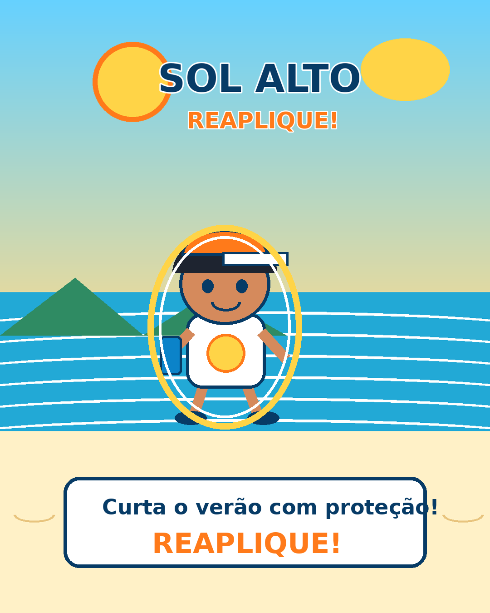

# ☀️ Sol Alto — Missão Reaplique!

Projeto Final — Prática 02: Advergame  
Disciplina: Modelagem e Animação 3D — FMU

## 🎮 Jogue no navegador
**Link do jogo:** depois de ativar o GitHub Pages, substitua a linha abaixo pela URL gerada:

`[https://SEU-USUARIO.github.io/NOME-DO-REPOSITORIO/game/](https://claudiohideki9-creator.github.io/Pratica2_Modelagem-e-Anima-o-3D/advergame_sol_alto_pronto_github/advergame_sol_alto/game/)`

> Configuração sugerida no GitHub: **Settings → Pages → Deploy from a branch → main / (root)**.

## Sobre o jogo
“Sol Alto — Missão Reaplique!” é um advergame fictício para a campanha de verão **Reaplique!**. Sunny precisa coletar protetor solar, água e óculos, evitar o sol forte e manter a barra de proteção durante 45 segundos. O produto faz parte da mecânica: reaplicar recupera a proteção.

## Como jogar
- **Celular:** toque/arraste horizontalmente.
- **Computador:** mouse ou setas ← →.
- Protetor: +10 e recupera proteção.
- Água: +5.
- Óculos: +5.
- Sol forte: -10 e reduz proteção.
- Protetor especial: +20 e Proteção Máxima por 5 segundos.

## Entregáveis
| Entregável | Local |
|---|---|
| Briefing e conceitos | `briefing/` |
| Mini-GDD | `docs/mini-gdd_v01.md` |
| Relatório final | `docs/relatorio_final.md` |
| Ficha e log de prompts | `prompts/` |
| Assets | `assets/` |
| Jogo HTML5 | `game/index.html` |
| Link do jogo | `game/link_do_jogo.txt` |
| Prints | `game/prints/` |
| Key art | `divulgacao/divulgacao_keyart_v01.png` |

## Publicação no GitHub Pages
1. Crie um repositório no GitHub.
2. Envie **todo o conteúdo desta pasta** para a raiz do repositório.
3. Abra **Settings → Pages**.
4. Em **Build and deployment**, escolha **Deploy from a branch**.
5. Selecione `main` e `/ (root)` e salve.
6. O jogo ficará em `[https://SEU-USUARIO.github.io/NOME-DO-REPOSITORIO/game/](https://claudiohideki9-creator.github.io/Pratica2_Modelagem-e-Anima-o-3D/advergame_sol_alto_pronto_github/advergame_sol_alto/game/)`.
7. Atualize esse endereço neste README e em `game/link_do_jogo.txt`.
8. Teste o link no celular e em uma aba anônima.

## Declaração
Marca, campanha e produto são fictícios e foram criados para fins educacionais. O projeto foi desenvolvido com auxílio de IA generativa. O jogo não solicita nem armazena dados pessoais.
